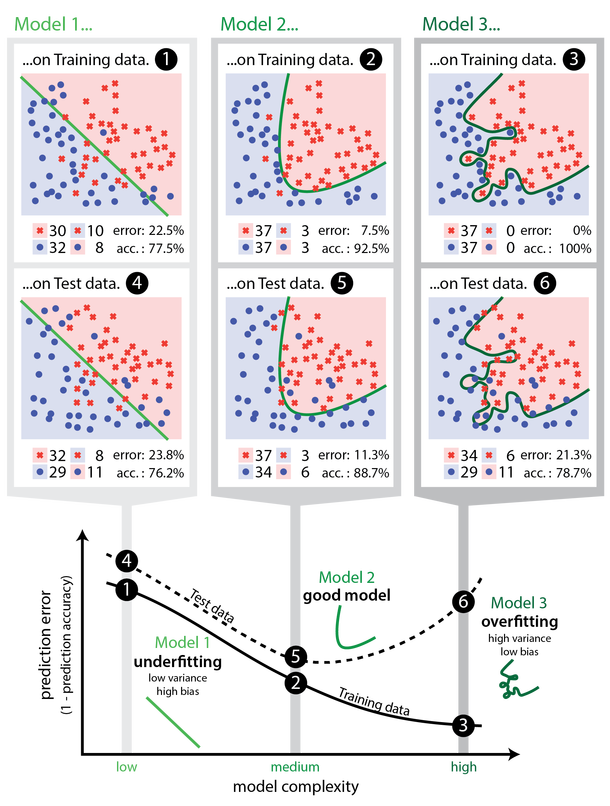

# Podział metod data mining

## Rodzaje wnioskowania

*Data mining* to zestaw metod pozyskiwania wiedzy na podstawie danych. Ową wiedzę zdobywamy w procesie wnioskowania na podstawie modeli. Wnioskowanie możemy podzielić na dedukcyjne i indukcyjne. I tak z wnioskowaniem dedukcyjnym mamy do czynienia wówczas, gdy na podstawie obecnego stanu wiedzy potrafimy odpowiedzieć na postawione pytanie dotyczące nowej wiedzy, stosując reguły wnioskowania. O wnioskowaniem indukcyjnym powiemy, że jest to metoda pozyskiwania wiedzy na podstawie informacji ze zbioru uczącego. Znajduje ono szerokie zastosowanie w data mining i charakteryzuje się omylnością, ponieważ nawet najlepiej nauczony model na zbiorze uczącym nie zapewnia nam prawdziwości odpowiedzi w przypadku nowych danych, a jedynie je uprawdopodabnia. Esencją wnioskowania indukcyjnego w zakresie data mining, jest poszukiwanie na podstawie danych uczących modelu charakteryzującego się najlepszymi właściwościami predykcyjnymi i dającego się zastosować do zupełnie nowego zbioru danych.

Każdy proces uczenia z wykorzystaniem wnioskowania indukcyjnego składa się z następujących elementów.

### Dziedzina

*Dziedzina* to zbiór wszystkich obiektów pozostających w zainteresowaniu badacza, będących przedmiotem wnioskowania, oznaczana najczęściej przez $X$. Przykładowo mogą to być zbiory osób, transakcji, urządzeń, instytucji, itp.

### Obserwacja

Każdy element dziedziny $x\in X$ nazywamy obserwacją. Obserwacją nazywać będziemy zarówno rekordy danych ze zbioru uczącego, jak i ze zbioru testowego.

### Atrybuty obserwacji

Każdy obiekt z dziedziny $x\in X$ można opisać zestawem cech (atrybutów), które w notacji matematycznej oznaczymy przez $a:X\to A$, gdzie $A$ jest przestrzenią wartości atrybutów. Każda obserwacja $x$ posiadająca $k$ cech da się wyrazić wektorowo jako $(a_1(x), a_2(x), \ldots, a_k(x))$. Dla większości algorytmów uczenia maszynowego wyróżnia się trzy typy atrybutów:
- *nominalne* - posiadające skończoną liczbę stanów, które posiadają porządku;
- *porządkowe* - posiadające skończoną liczbę stanów z zachowaniem porządku;
- *ciągłe* - przyjmujące wartości numeryczne.
Często jeden z atrybutów spełnia specjalną rolę, ponieważ stanowi realizację cechy, którą traktujemy jako wyjściową (ang. *target value attribute*). W tym przypadku powiemy o **nadzorowanym uczeniu maszynowym**. Jeśli zmiennej wyjściowej nie ma dziedzinie, to mówimy o **nienadzorowanym uczeniu maszynowym**.

### Zbiór uczący

Zbiorem uczącym $T$ (ang. *training set*) nazywamy podzbiór $D$ dziedziny $X$ (czyli $T\subseteq D\subseteq X$), gdzie zbiór $D$ stanowi ogół dostępnych obserwacji z dziedziny $X$. Zbiór uczący zawiera informacje dotyczące badanego zjawiska, na podstawie których, dokonuje się doboru modelu, selekcji cech istotnych z punktu widzenia własności predykcyjnych lub jakości klasyfikacji, budowy modelu oraz optymalizacji jego parametrów. W przypadku uczenia z nauczycielem (nadzorowanego) zbiór $T$ zawiera informację o wartościach atrybutów zmiennej wynikowej.

### Zbiór testowy

Zbiór testowy $T'$ (ang. *test set*) będący dopełnieniem zbioru uczącego do zbioru $D$, czyli $T'=D\setminus T$, stanowi zestaw danych służący do oceny poprawności modelu nadzorowanego. W przypadku metod nienadzorowanych raczej nie stosuje się zbiorów testowych.

### Model

Model to narzędzie pozyskiwania wiedzy na podstawie zbioru uczącego. Nauczony model jest zbiorem reguł $f$, którego zadaniem jest oszacowanie wielkości wartości wynikowej lub odpowiednia klasyfikacja obiektów. W zadaniu grupowania obiektów (ang. *clustering task*), celem modelu jest podanie grup możliwie najbardziej jednorodnych przy zadanym zestawie zmiennych oraz ustalonej liczbie skupień (czasami wyznaczenie liczby skupień jest również częścią zadania stawianego przed modelem). 

### Jakość dopasowania modelu

Do oceny jakości dopasowania modelu wykorzystuje się, w zależności od zadania, wiele współczynników (np. dla zadań regresyjnych są to błąd średnio-kwadratowy - ang. *Mean Square Error* a dla zadań klasyfikacyjnych - trafność  - ang. *Accuracy*). Możemy mówić dwóch rodzajach dopasowania modeli:

- poziom dopasowania na zbiorze uczącym
- poziom dopasowania na zbiorze testowym (oczywiście z punktu widzenia utylitarności modelu ten współczynnik jest ważniejszy).

W sytuacji, w której model wykazuje dobre charakterystyki jakości dopasowania na zbiorze uczącym ale słabe na testowym, mówimy o zjawisku przeuczenia modelu (ang. *overfitting*). Oznacza to, że model wskazuje predykcję poprawnie jedynie dla zbioru treningowego ale ma słaba własności generalizacyjne nowe przypadki danych. Takie model nie przedstawiają znaczącej wartości w odkrywaniu wiedzy w sposób indukcyjny. 

Z drugiej strony parametry dopasowania modelu mogą pokazywać słabe dopasowanie, zarówno na zbiorze uczącym, jak i testowym. Wówczas również model nie jest użyteczny w pozyskiwaniu wiedzy na temat badanego zjawiska, a sytuację taką nazywamy niedouczeniem (ang. *underfitting*).

```{r echo=FALSE, fig.cap="Przykłady niedoucznia (wykresy 1 i 4), poprawego modelu (2 i 5) i przeuczenia (3 i 6). Pierwszy wiersz wykresów pokazuje klasyfikację na podstawie modelu na zbiorze uczącym, a drugi na zbiorze testowym. Wykres na dole pokazuje związek pomiędzy złożonością modelu a wielkością błędu predykcji. *Źródło*: https://cambridgecoding.wordpress.com/2016/03/24/misleading-modelling-overfitting-cross-validation-and-the-bias-variance-trade-off/"}

```

## Modele regresyjne

Jednym z rodzajów zadań bazującym na wnioskowaniu indukcyjnym jest model regresyjny. Należy on do grupy metod nadzorowanych, których celem jest oszacowanie wartości cechy wyjściowej (która jest ilościowa) na podstawie zestawu predyktorów, które mogą być ilościowe i jakościowe. Uczenie takich modeli odbywa się poprzez optymalizację funkcji celu (np. $MSE$) na podstawie zbioru uczącego. 

## Modele klasyfikacyjne

Podobnie jak modele regresyjne, modele klasyfikacyjne należą do grupy metod nadzorowanego uczenia maszynowego. Ich zadaniem jest właściwa klasyfikacja obiektów na podstawie wielkości predyktorów. Odpowiedzią modelu jest zawsze cecha typu jakościowego, natomiast predyktory mogą mieć dowolny typ. Wyróżnia się klasyfikację dwu i wielostanową. Lista modeli realizujących klasyfikację binarną jest nieco dłuższa niż w przypadku modeli z wielostanową cechą wynikową. Proces uczenia modelu klasyfikacyjnego również opiera się na optymalizacji funkcji celu. Tym razem są to zupełnie inne miary jakości dopasowania (np. trafność, czyli odsetek poprawnych klasyfikacji).

## Modele grupujące

Bardzo szeroką gamę modeli nienadzorowanych stanowią metody analizy skupień. Ich zadaniem jest grupowanie obiektów w możliwie najbardziej jednorodne grupy, na podstawie wartości atrybutów poddanych analizie. Ponieważ są to metody "bez nauczyciela", to ocena ich przydatności ma nieco inny charakter i choć istnieją różne wskaźniki jakości grupowania, to trudno tu o obiektywne wskazanie najlepszego rozwiązania.

