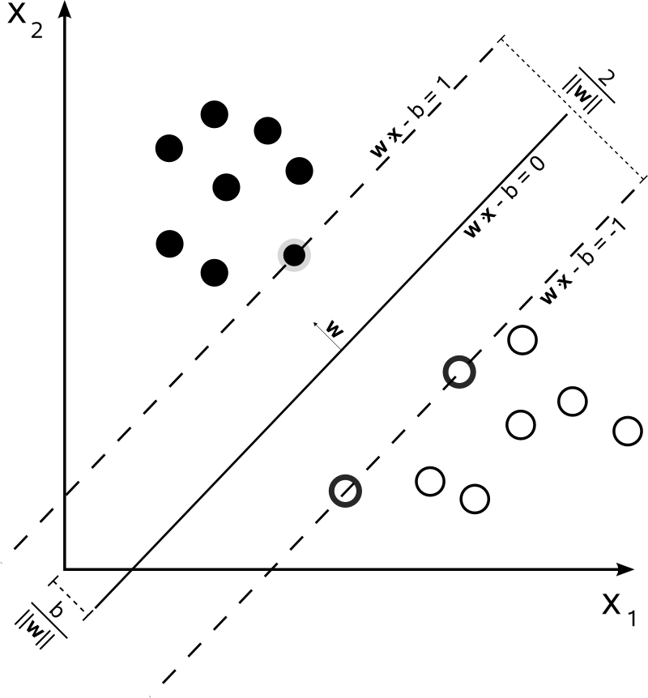

# Metoda wektorów nośnych

## Wprowadzenie

**Metoda wektorów nośnych**^[lub podpierających] (ang. *Support Vector Machines*) to kolejna metoda klasyfikacji obserwacji na podstawie cech (atrybutów). Jest techniką z nauczycielem tzn., że w próbie uczącej występują zarówno cechy charakteryzujące badane obiekty jak i ich przynależność do klasy. 

```{r svm1, echo=FALSE, fig.align='center', fig.cap="Przykład prostych separujących obiekty obu grup"}
knitr::include_graphics("images/SVM_Example_of_Hyperplanes.png", dpi=100)
```

## Definicja modelu dla klas liniowo separowalnych

Istotą tej metody jest znalezienie wektorów nośnych, definiujących hiperpowierzchnie optymalnie separujące obiekty w homogeniczne grupy.

Niech $D$ będzie zbiorem $n$ punktów w $d$-wymiarowej przestrzeni określonych następująco $(\vec{x}_i, y_i)$, $i=1,\ldots, d$, gdzie $y_i$ przyjmuje wartości -1 lub 1 w zależności od tego do której grupy należy (zakładamy istnienie tylko dwóch grup). Poszukujemy takiej hiperpłaszczyzny, która maksymalizuje margines pomiędzy punktami obu klas w przestrzeni cech $\vec{x}$.

```{r svm2, echo=FALSE, fig.align='center', fig.cap="Płaszczyzna najlepiej rozdzielająca obiekty obu grup (białe i czarne kropki) wraz z prostymi wyznaczającymi maksymalny margines separujący obie grupy"}

```

Margines ten jest określany jako najmniejsza odległość pomiędzy hiperpłaszczyzną i elementami z każdej z grup. Dowolna hiperpłaszczyzna może być zapisana równaniem $\vec{w}\vec{x}-b=0$, gdzie $\vec{w}$ jest wektorem normalnym do hiperpłaszczyzny. Jeśli dane są liniowo separowalne to, można wybrać takie dwie hiperpłaszczyzny, że odległość pomiędzy nimi jest największa. Równania tych hiperpłaszczyzn dane są wzorami
\begin{equation}
	\vec{w}\vec{x}-b=1, \quad \vec{w}\vec{x}-b=-1
	(\#eq:hiper1)
\end{equation}

Odległość pomiędzy tymi hiperpłaszczyznami wynosi $\tfrac{2}{\|\vec{w}\|}$. Zatem żeby zmaksymalizować odległość pomiędzy hiperpłaszczyznami (margines) musimy zminimalizować $\tfrac{\|\vec{w}\|}{2}$.
Dodatkowo, żeby nie pozwolić aby punkty wpadały do marginesu musimy nałożyć dodatkowe ograniczenia
\begin{align}
	\vec{w}\vec{x}_i-b\geq& 1, \quad   y_i=1\\
	\vec{w}\vec{x}_i-b\leq& -1, \quad y_i=-1
	(\#eq:hiper2)
\end{align}
Co można zapisać prościej
\begin{equation}
	y_i(\vec{w}\vec{x}_i-b)\geq 1,\quad 1\leq i\leq n.
	(\#eq:hiper3)
\end{equation}
Zatem $\vec{w}$ i $b$ minimalizujące $\|\vec{w}\|$ przy jednoczesnym spełnieniu warunku \eqref{hiper3} definiują klasyfikator postaci
\begin{equation}
	\vec{x}\rightarrow \operatorname{sgn}(\vec{w}\vec{x}-b).
	(\#eq:hiper4)
\end{equation}

Z racji, że $\|\vec{w}\|$ jest określona jako pierwiastek sumy kwadratów poszczególnych współrzędnych wektora, to częściej w minimalizacji stosuje się $\|\vec{w}\|^2$.
	
Sformułowany powyżej problem należy do grupy optymalizacji funkcji kwadratowej przy liniowych ograniczeniach. Rozwiązuje się go metodą mnożników Lagrange'a.
	
Minimalizujemy funkcję 
\begin{equation}
	L(w, b, \alpha) = \frac{1}{2}\|\vec{w}\|^2-\sum_{i=1}^{n}\alpha_i\big(y_i(\vec{w}\vec{x}_i-b)-1\big),
	(\#eq:lagrange)
\end{equation}
gdzie $\alpha_i$ są mnożnikami Lagrange'a.

Niestety rozwiązanie takiego równania różniczkując po $\vec{w}$ i $b$ i przyrównując do zera nie jest łatwe. Dlatego Karush-Kuhn Tucker wprowadzili ograniczenia na mnożniki $\alpha_i\geq 0$ oraz $\alpha_i\big(y_i(\vec{w}\vec{x}_i-b)-1\big)=0$. Co w konsekwencji powoduje, że $\alpha_i$ są niezerowe jedynie dla wektorów nośnych, a dla pozostałych 0.

Dalej jednak poszukiwanie rozwiązania zagadnienia minimalizacji funkcji $L$ ze względu na tak wiele parametrów może być uciążliwe. Wówczas stosuje się maksymalizację dualnej wersji^[w przypadku przestrzeni wypukłej oba rozwiązania się pokrywają]
\begin{equation}
	L_D(\alpha) = \sum_{i=1}^{n}\alpha_i+\frac{1}{2}\sum_{i=1}^{n}\sum_{j=1}^{n}\alpha_i\alpha_jy_iy_j\vec{x}_i'\vec{x}_j
	(\#eq:lagrange2)
\end{equation}
przy ograniczeniach $\alpha_i\geq 0$ i $\sum_{i=1}^{n}\alpha_iy_i=0$.

Rozwiązaniem powyższego zagadnienia jest 
\begin{align}
	\vec{w}=&\sum_{i=1}^{n}\alpha_iy_i\vec{x}_i,(\#eq:lagrange3)\\
		b=&y_i-\vec{w}\vec{x}_i,
		(\#eq:lagrange4)
\end{align}
a hiperpłaszczyzna decyzyjna 
\begin{equation}
\sum_{i=1}^{n}\alpha_iy_i\vec{x}_i\vec{x}-b=0,
(\#eq:hiper5)
\end{equation}
gdzie $\vec{x}_i$ są wektorami nośnymi ze zbioru uczącego, a $\vec{x}$ jest nowym wektorem dla którego przeprowadzamy klasyfikację.
Należy również zauważyć, że im większa wartość $\alpha_i$, tym większy wpływ wektora na granicę decyzyjną.

## Definicja modelu dla klas nieliniowo separowalnych

Niestety rzadko przestrzeń atrybutów jest liniowo separowalna. Stosuje się wówczas modyfikację powyższej metody przez wprowadzenie następującej funkcji straty
\begin{equation}
	\zeta_i=\max\big(0,1-y_i(\vec{w}\vec{x}_i-b)\big).
	(\#eq:strata1)
\end{equation}
Zauważmy, że $\zeta_i$ jest najmniejszą liczbą nieujemną spełniającą nierówność
\begin{equation}
	y_i(\vec{w}\vec{x}_i-b)\geq 1-\zeta_i.
	(\#eq:nier)
\end{equation}
Możemy ją interpretować tak, że jeśli warunek \@ref(eq:hiper3) jest spełniony, czyli punkty leżą na zewnątrz marginesu (po właściwych stronach), to funkcja straty przyjmuje wartość 0. W przeciwnym przypadku wartość funkcji jest proporcjonalna do odległości od brzegu marginesu. Dlatego wystarczy zminimalizować wartość
\begin{equation}
	\frac{1}{n}\sum_{i=1}^{n}\zeta_i+\lambda\|\vec{w}\|^2,
	(\#eq:strata2)
\end{equation}
przy warunku \@ref(eq:nier) i $\zeta_i\geq 0$ oraz gdzie $\lambda$ jest wagą kompromisu pomiędzy szerokością marginesu a zapewnieniem, że punkty leżą po właściwych stronach marginesu. Przy dostatecznie małych wartościach $\lambda$ i separowalności liniowej punktów przestrzeni atrybutów powyższy klasyfikator będzie się zachowywał podobnie jak \@ref(eq:hiper4).

Rozwiązanie problemu minimalizacji funkcji straty określonej w \@ref(eq:strata2) za pomocą dualnej wersji mnożników Lagrange'a sprowadza się do minimalizacji funkcji
\begin{equation}
	L(\alpha_i) = \sum_{i=1}^{n}\alpha_i+\frac{1}{2}\sum_{i=1}^{n}\sum_{j=1}^{n}\alpha_i\alpha_jy_iy_j\vec{x}_i'\vec{x}_j,
(\#eq:strata3)	
\end{equation}
przy warunkach 
\begin{equation}
	\sum_{i=1}^{n}\alpha_iy_i=0,\quad 0\leq \alpha_i\leq \frac{1}{2n\lambda}.
	(\#eq:nier2)
\end{equation}
Wektor normalny do hiperpłaszczyzny jest postaci
\begin{equation}
	\vec{w}=\sum_{i=1}^{n}\alpha_iy_i\vec{x}_i,
	(\#eq:wagi2)
\end{equation}
a parametr $b$ taki jak w \@ref(eq:lagrange4).
	
Powyższy algorytm został przedstawiony przez Vapnika w 1963 roku jako klasyfikator liniowy ale dopiero po wprowadzeniu funkcji jądrowych przekształcających liniowy brzeg decyzyjny na nieliniowy, metoda ta zyskała w oczach statystyków.

## Definicja modelu jądrowego

W roku 1992 Boser, Guyon i Vapnik wprowadzili pojęcie nieliniowego klasyfikatora opartego na metodzie wektorów nośnych, który było uogólnieniem techniki przedstawionej przez Vapnika w 1963 roku. Pozwala ona na nieliniowy kształt brzegu obszaru decyzyjnego.

Zasada działania polega na znalezieniu takiego jądra przekształcenia (ang. *kernel*) $\phi$, które odwzoruje przestrzeń $d$-wymiarową w $d'$-wymiarową, gdzie $d'>d$ taką, że $D_{\phi}=\{\phi(\vec{x}_i), y_i\}$ jest możliwie jak najbardziej separowalna.

```{r svm3, echo=FALSE, fig.align='center', fig.cap="Przykład zastosowania takiego przekształcenia jądrowego aby z sytuacji braku liniowej separowalności do niej doprowadzić"}
knitr::include_graphics("images/Kernel_Machine.png")
```

Dla funkcji jądrowej określonej wzorem $k(\vec{x}_i,\vec{x}_j)=\phi(\vec{x}_i)\phi(\vec{x}_j)$ przeprowadzamy identyczne rozumowanie jak w przypadku liniowych brzegów obszarów decyzyjnych.
Minimalizujemy zatem wyrażenie
\begin{align}
	L(\alpha_i) =& \sum_{i=1}^{n}\alpha_i+\frac{1}{2}\sum_{i=1}^{n}\sum_{j=1}^{n}\alpha_i\alpha_jy_iy_j\phi(\vec{x}_i)\phi(\vec{x}_j)\\
		=&\sum_{i=1}^{n}\alpha_i+\frac{1}{2}\sum_{i=1}^{n}\sum_{j=1}^{n}\alpha_i\alpha_jy_iy_jk(\vec{x}_i,\vec{x}_j),
		(\#eq:strata4)
\end{align}
przy warunkach 
\begin{equation}
	\sum_{i=1}^{n}\alpha_iy_i=0,\quad 0\leq \alpha_i\leq \frac{1}{2n\lambda}.
	(\#eq:nier3)
\end{equation}
Rozwiązanie powyższego problemu są również podobne do ich liniowych odpowiedników
\begin{equation}
	\vec{w}=\sum_{i=1}^{n}\alpha_iy_i\phi(\vec{x}_i),
	(\#eq:wagi3)
\end{equation}
a parametr $b=\vec{w}\phi(\vec{x}_i)-y_i$.


Najczęściej stosowanymi funkcjami jądrowymi są:

- wielomianowa $k(\vec{x}_i,\vec{x}_j)=(a\vec{x}_i'\vec{x}_j+b)^q$,
- gaussowska $k(\vec{x}_i,\vec{x}_j)=\exp(-\gamma\|\vec{x}_i-\vec{x}_j\|^2)$,
- Laplace'a $k(\vec{x}_i,\vec{x}_j)=\exp(-\gamma\|\vec{x}_i-\vec{x}_j\|)$,
- hiperboliczna $k(\vec{x}_i,\vec{x}_j)=\tanh(\vec{x}_i'\vec{x}_j+b)$,
- sigmoidalna $k(\vec{x}_i,\vec{x}_j)=\tanh(a\vec{x}_i'\vec{x}_j+b)$,
- Bessel'a $k(\vec{x}_i,\vec{x}_j)=\frac{Bessel^n_{(\nu+1)}(\sigma\|\vec{x}_i-\vec{x}_j\|)}{(\|\vec{x}_i-\vec{x}_j\|)^{n(\nu+1)}}$,
- ANOVA $k(\vec{x}_i,\vec{x}_j)=\left(\sum_{k=1}^{n}\exp\big(-\sigma(x^k_i-x^k_j)^2\big)\right)^d$,
- sklejana dla jednowymiarowej przestrzeni $k(x_i,x_j)=1+x_ix_j\min(x_i,x_j)-\frac{x_i+x_j}{2}\big(\min(x_i,x_j)\big)^2+\frac{(\min(x_i,x_j))^3}{3}$.

W przypadku braku wiedzy o danych funkcja gaussowska, Laplace'a i Bessel'a są zalecane.

**Przykłady obszarów zastosowań:**

- w kategoryzacji tekstu i hipertekstu;
- klasyfikacji obrazów - rezultaty eksperymentów pokazują, że SVM daje lepsze rezultaty niż inne techniki;
- rozpoznawanie obiektów 3D;
- odnajdowanie włamań do systemu;
- rozpoznawanie pisma ręcznego;
- odkrywanie ukrytych treści na zdjęciach;
- klasyfikacja protein;
- odnajdowanie sekwencji kodu genetycznego
- itp...

## Zalety i wady

Mocne strony:

- stopień skomplikowania nie jest zależny od wymiaru przestrzeni atrybutów;
- optymalny klasyfikator (znajduje minimum globalne);
- nie jest czuły na przetrenowanie;
- bardzo duża skuteczność w praktyce.

Słabe strony:

- przy dużej ilości danych estymacja modelu może trwać długo;
- estymacja poprawnego modelu wymaga pewnej wiedzy;
- nie ma miejsca na wprowadzenie własnej wiedzy.


